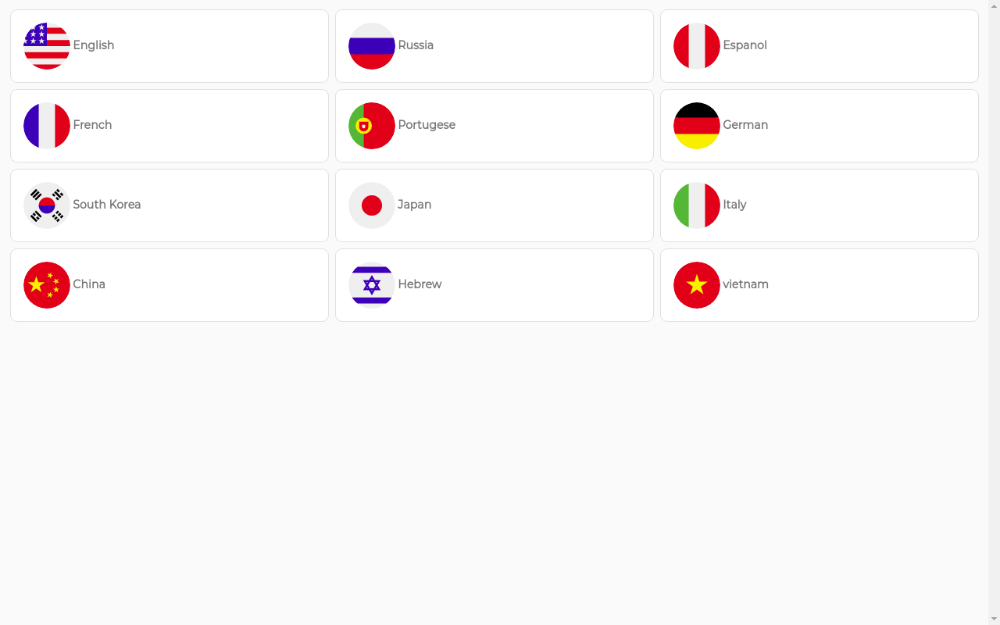
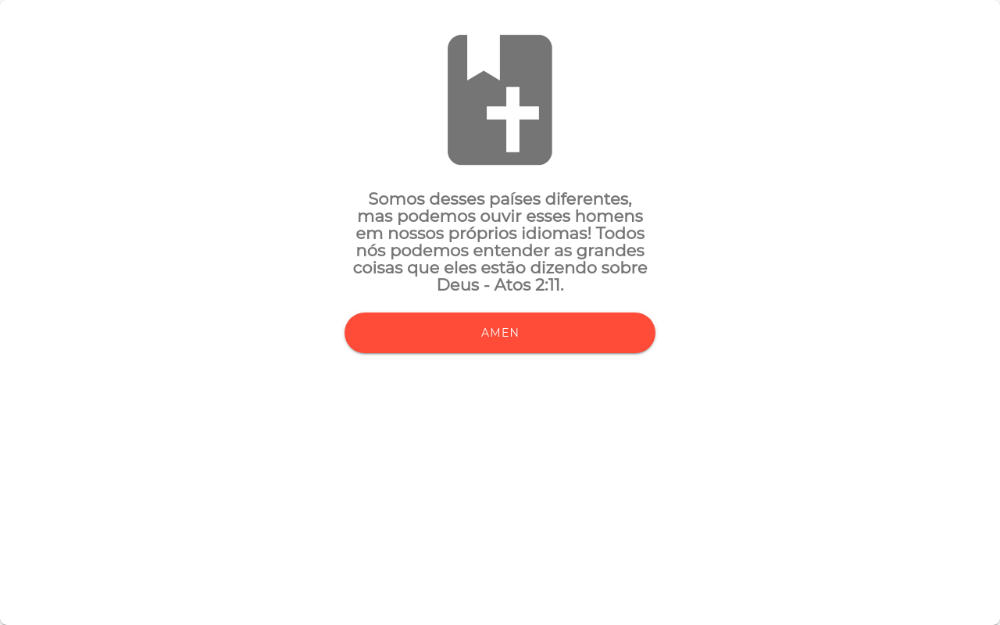

# Pentecost APP

This consist of the client and server codes, nothing to say for now..

## TODO

We've found the issues. A. Login in user immediately after creation and show him only a form to insert the socket he wants to connect to. Place an alert that says he can connect to his own socket but others have to connect also to it to chat with him.

# Caveats

### Due to SPA mode, full reload needs to be taking care of

 

 

